# ☕ Cafe Order iOS Application  

An iOS application for a smooth café ordering experience. New users can sign up and create a profile, while existing users can log in to place orders. The app provides a clean and user-friendly interface with personalized offers, customizable menu items, and a seamless cart and checkout flow.  

---

## 🚀 Features  

- **User Authentication**
  - Sign up and login with email & password (Firebase Authentication).  
  - User details (name, birthday, etc.) stored in Firestore.  
  - Logout functionality.  

- **Personalized Home Page**
  - Welcome message including the user’s name.  
  - Birthday-based offers.  
  - Auto-scrolling banners & offers (UIScrollView + UIPageController).  

- **Menu & Search**
  - Menu categories displayed in **UICollectionView** (Hot Beverages, Cold Beverages, Food, Desserts).  
  - "View All" option shows all items in a **UITableView**.  
  - **UISearchController** for live item filtering.  
  - Menu data fetched via **API Integration**.  
  - Images downloaded & cached using **Kingfisher**.  

- **Cart & Customization**
  - Add items with or without customization.  
  - Custom sheet presentation (`UISheetPresentationController`) for adding to cart.  
  - Custom stepper for quantity adjustment.  
  - Real-time total price updates before adding to cart.  
  - Persistent cart stored using **UserDefaults**.  

- **Cart Review & Order Placement**
  - View added items with details, customization, and quantity.  
  - Edit or delete items.  
  - View final price before checkout.  
  - Place order: cart data is sent via **POST request** to the API.  
  - Order success animation using **CoreAnimation**.
 
- **My Account Page**
  - View and edit profile details (name, birthday).  
  - Logout option.  

- **UI/UX**
  - Clean, responsive UI using Auto Layout constraints.  
  - Smooth animations for app launch and order placement.
  - Supports both light & dark mode 

---

## 🛠 Tech Stack  

- **Language:** Swift  
- **Framework:** UIKit  
- **Architecture:** MVVM  
- **Backend & Auth:** Firebase Authentication + Firestore  
- **Networking:** URLSession (API Integration)  
- **Image Handling:** Kingfisher (download & caching)  
- **Local Storage:** UserDefaults  
- **Animations:** CoreAnimation  

---

## 🌐 API Integration  

The app communicates with a REST API for menu and order management:  

- **GET /menu** → Fetches all items.  
- **POST /orders** → Sends the user’s cart to the server when placing an order.

---

## 📲 Installation & Setup  

1. Clone this repository:  
   ```bash
   git clone https://github.com/your-username/cafe-order-ios-app.git
2. Open the project in Xcode.
3. Install dependencies via Swift Package Manager or CocoaPods:
    - Add Firebase (Authentication + Firestore)
    - Add Kingfisher via Swift Package Manager.
4. Configure Firebase:
    - Create a Firebase project in Firebase Console.
    - Add your iOS app and download the GoogleService-Info.plist.
    - Add it to your Xcode project.
5. Build & run the project on a simulator or physical device.

---

## 🎯 Usage

- New users can sign up with email & password, add details, and start browsing the menu.
- Existing users can log in with registered credentials.
- Browse the menu, search items, customize & add them to the cart.
- Review your cart and place an order.
- Manage your profile and logout anytime.

---

# 📸 Screenshots

<p align="center">   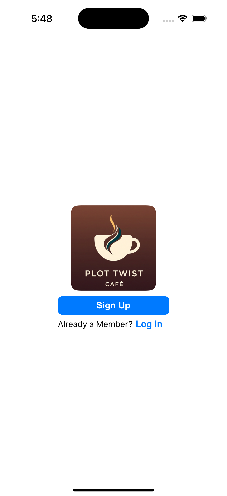 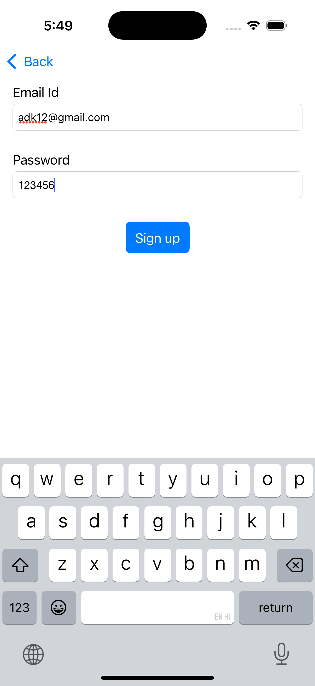 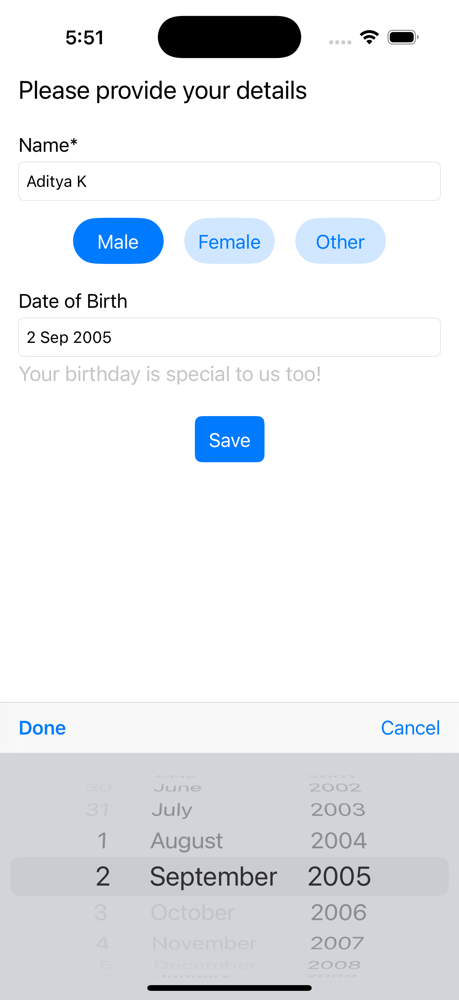 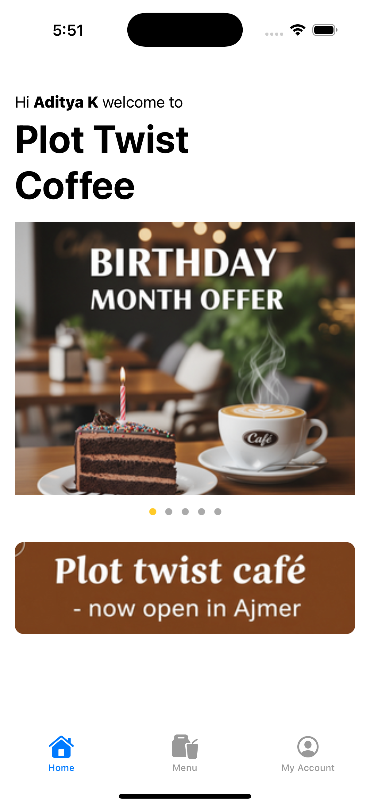 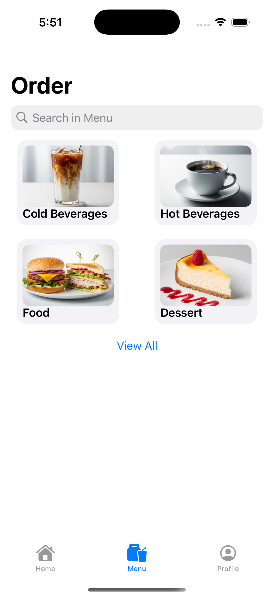 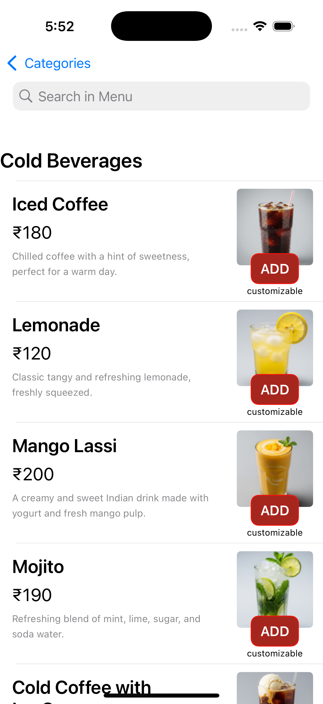 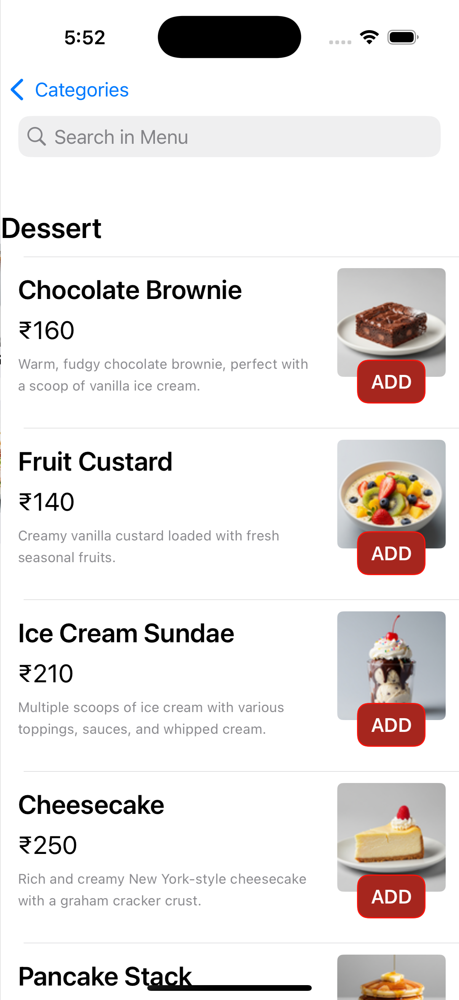 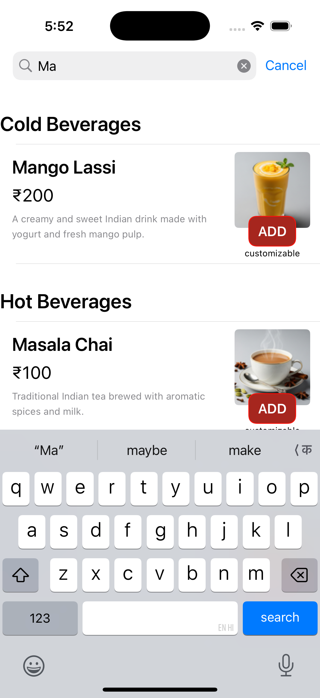 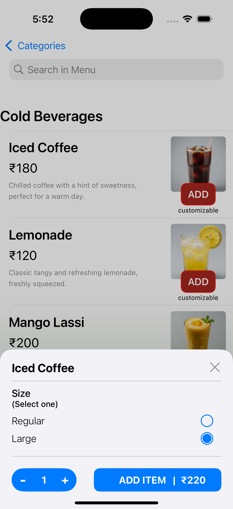 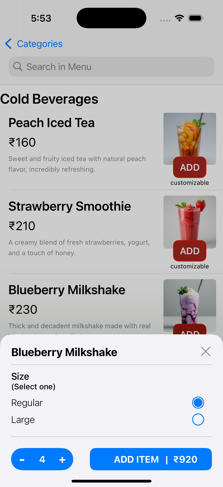 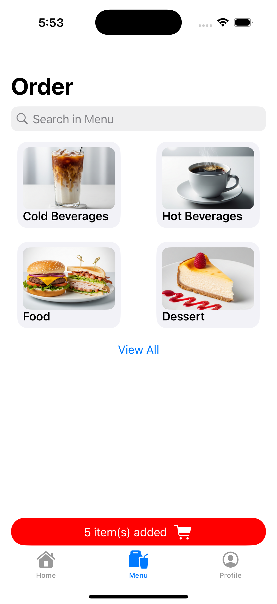 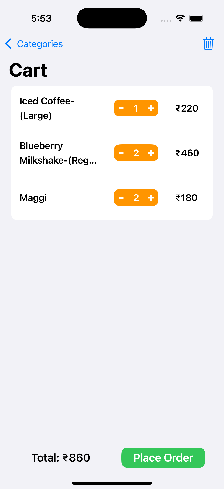 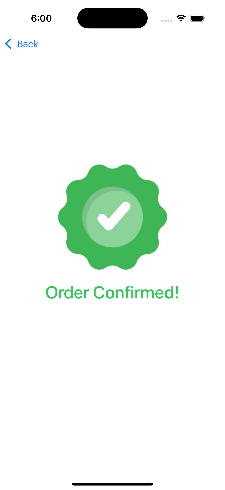 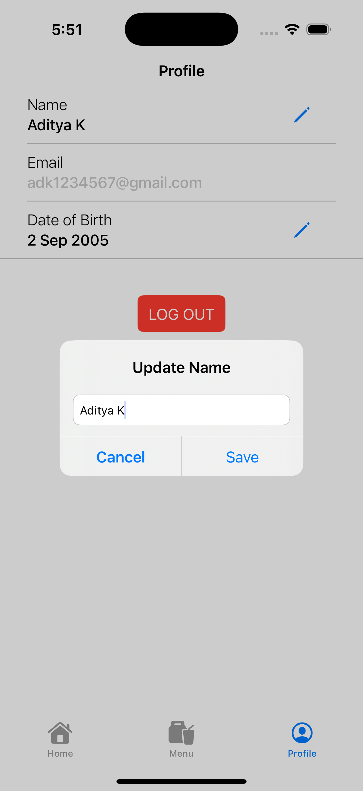 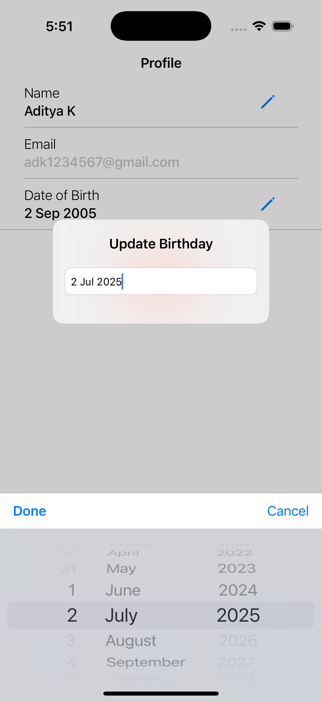 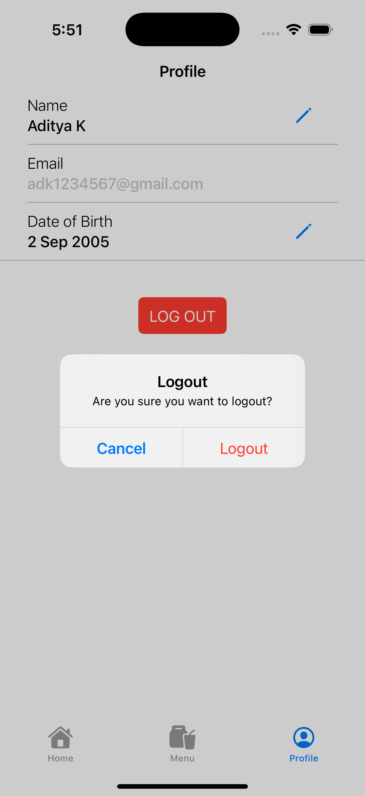 </p>

---

# 🔮 Future Enhancements

 - Add payment gateway integration
 - Push notifications
 - Apple Sign-In / Google Sign-In support

---

# 🤝 Contribution

Contributions are welcome! If you'd like to improve the app, please fork the repo and submit a pull request.

---

# 🙏 Acknowledgements

Made with ❤️ in Swift for the love of iOS developement and coffee
 - Firebase — Authentication & Firestore
 - Kingfisher — Image downloading & caching
 - UIKit + Swift Community
